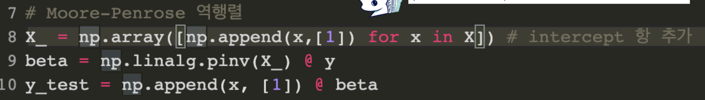
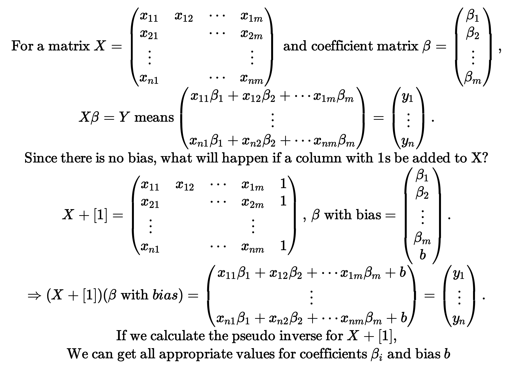

# 2021-08-04

### Assignment 5 Morse Code 관련 

민준님 & 승환님

- 띄어쓰기 처리하기가 어려움 @ decoding_sentence, encoding_sentence 함수
- 정규식으로 어떻게 처리해야 하나? `_@#$%\^&*()-+=[]{}\"\';:\|`~ vs `_@#$%^&*()-+=[]{}"';:\|`~

### Moore-Penrose Inverse 관련

Q. `AI Math 2. 행렬이 뭐에요` 강의 자료 37pg에서 Moore-Penrose 역행렬을 구할 때 Incercept 열 [1]을 직접 추가하는 이유가 무엇일까? 무엇보다 sklearn의 LinearRegression과 같은 값이 나오지 않는다.



박이상 캠퍼님도 비슷한 의문을 갖고 있는 듯 하다.



- bias가 0인 test 케이스가 아니었는지?
- numpy에서 수행한 근사치라고 충분히 볼만한 값이 아닌가?
- 질문 게시판에 올리는 걸로!

### Moore-Penrose Inverse 논의 과정

(i) `sklearn.linear_model.LinearRegression()`과 
(ii) `np.linalg.pinv()` 결과값을 비교하는 코드

```python
""" 연주님과 미경님 코드 """
import numpy as np

# 예시는 3x + 2y + z + 5 = y가 될 수 있도록 설정
X = np.array([[1,-2,3],
              [7,5,0],
              [-2,-1,2]])
y = np.array([[9,9],[1,1],[11,11]])

```

```python
"""sklearn 을 활용한 회귀분석""" 
from sklearn.linear_model import LinearRegression
model = LinearRegression()
model.fit(X,y)
y_test_1 = model.predict(X)

y_test_1
# result: np.array([[9,9],[1,1],[11,11]])
```

```python
"""moore penrose 역행렬 with added column [1]""" 
X_ = np.array([np.append(x,[1]) for x in X]) # 3,3 -> 3,4

beta = np.linalg.pinv(X_) @ y # 4,3 * 3,2 = 4,2
y_test_2 =  np.array([np.append(x,[1]) for x in X]) @ beta  # 3,4 * 4,2
y_test_2

# result: np.array([[9,9],[1,1],[11,11]])
```

```python
""" moore penrose 역행렬 WITHOUT added column [1] """
beta = np.linalg.pinv(X) @ y # 4,3 * 3,2 = 4,2
y_test_2 =  X @ beta  # 3,4 * 4,2
y_test_2

# Result: np.array([[4,4],[-4,-4],[11,11]])
```

즉 우리가 알 수 있는 것은

- 연립방정식에 완전히 fit 할 수 있는 X matrix 예시라면  (i) `sklearn.linear_model.LinearRegression()`과 
  (ii) `np.linalg.pinv()` 결과값은 같다.
- 이때 Moore Penrose 역행렬에 column of [1]을 추가하지 않으면 `sklearn.linear_model.LinearRegression()`으로 구한 결과값이 다르게 된다.

-----------------------------------------------------------------

### 참고자료

- https://stats.stackexchange.com/questions/283618/how-to-get-intercept-with-moore-penrose-pseudo-inverse
- https://hadrienj.github.io/posts/Deep-Learning-Book-Series-2.9-The-Moore-Penrose-Pseudoinverse/

### Example 4.

To see the process with more data points we can generate data (see [this nice blog post](https://mec560sbu.github.io/2016/08/29/Least_SQ_Fitting/) for other methods of fitting).

We will generate a column vector (see `reshape()` bellow) containing 100 points with random xx values and pseudo-random yy values. The function `seed()` from the [Numpy.random package](https://docs.scipy.org/doc/numpy/reference/generated/numpy.random.seed.html) is used to freeze the randomisation and be able to reproduce the results:

```
np.random.seed(123)
x = 5*np.random.rand(100)
y = 2*x + 1 + np.random.randn(100)

x = x.reshape(100, 1)
y = y.reshape(100, 1)
```

We will create the matrix **A**A from **x**x by adding a column of ones exactly like we did in the example 3.

```
A = np.hstack((x, np.ones(np.shape(x))))
A[:10]
array([[ 3.48234593,  1.        ],
       [ 1.43069667,  1.        ],
       [ 1.13425727,  1.        ],
       [ 2.75657385,  1.        ],
       [ 3.59734485,  1.        ],
       [ 2.1155323 ,  1.        ],
       [ 4.90382099,  1.        ],
       [ 3.42414869,  1.        ],
       [ 2.40465951,  1.        ],
       [ 1.96058759,  1.        ]])
```

We can now find the pseudoinverse of **A**A and calculate the coefficients of the regression line:

```
A_plus = np.linalg.pinv(A)
coefs = A_plus.dot(y)
coefs
array([[ 1.9461907 ],
       [ 1.16994745]])
```

We can finally draw the point and the regression line:

```
x_line = np.linspace(0, 5, 1000)
y_line = coefs[0]*x_line + coefs[1]

plt.plot(x, y, '*')
plt.plot(x_line, y_line)
plt.show()
```

_Fitting a line to a set of data points_
